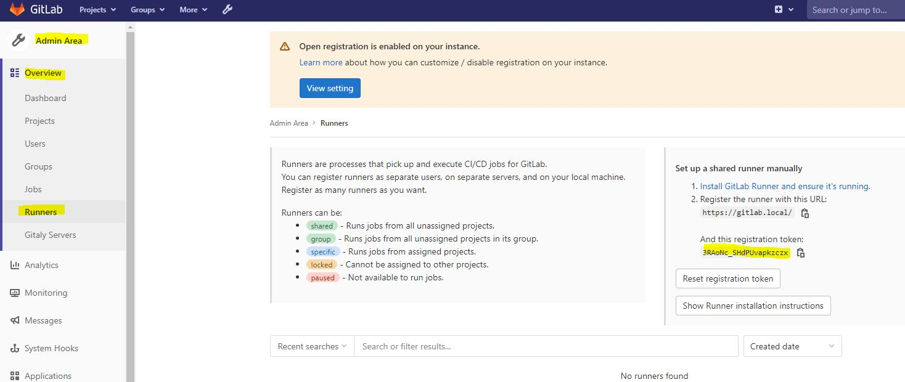

# gitlab-dev
Deploy Gitlab-web and Gitlab-runner in one host. **Only for testing and development**

## Installation

Edit GITLAB_HOME=<path to gitlab> in .env file.
  
docker-compose build

docker-compose up -d

cp $GITLAB_HOME/gitlab/config/ssl/gitlab-web.key $GITLAB_HOME/gitlab-runner1-config/certs/

cp %GITLAB_HOME/gitlab/config/ssl/gitlab-web.crt $GITLAB_HOME/gitlab-runner1-config/certs/

## Runner register  

